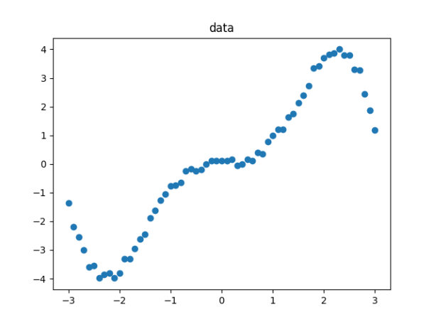
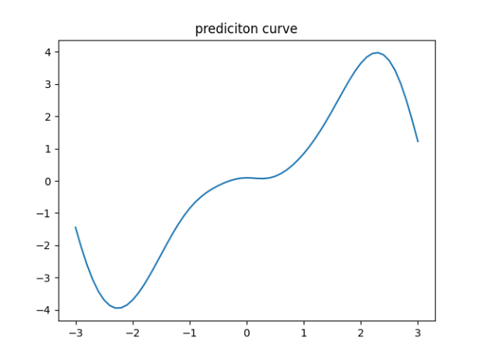

TASK:

1. Load data from the file dataXX.txt a . Split this data to training data and test data, 

2. Suggest an optimal neural network approximating the loaded data. Use a non-linear activation function in the hidden layer (e.g. tanh or sigmoidal). By applying backward propagation of the error, train the network with a batch method. 

3. Evaluate the network operation for matching (underfitting, optimal, overfitting). 

4. Change the method of providing data to on-line method. Train the network. Evaluate the network. 

5. Suggest a network with the RELU activation function. By applying backward propagation of the error, train the network with a batch
method. Evaluate the network. 

------
<h2>Results for the batch method are:</h2>

<h3>data:</h3> 

<h3>prediction curve:</h3>
